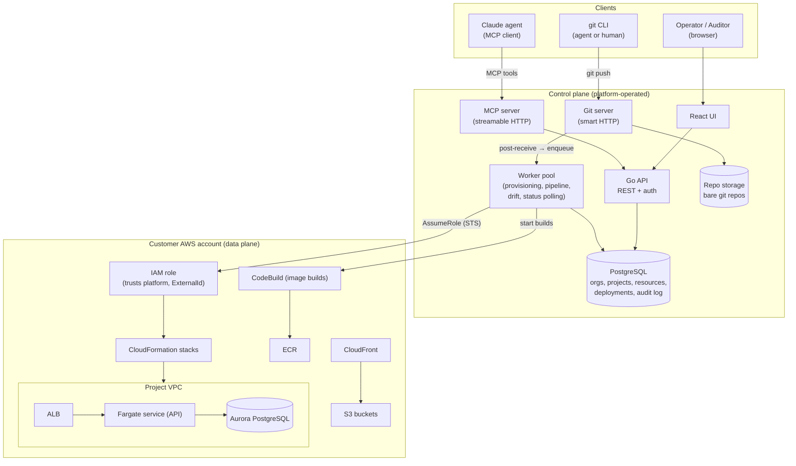
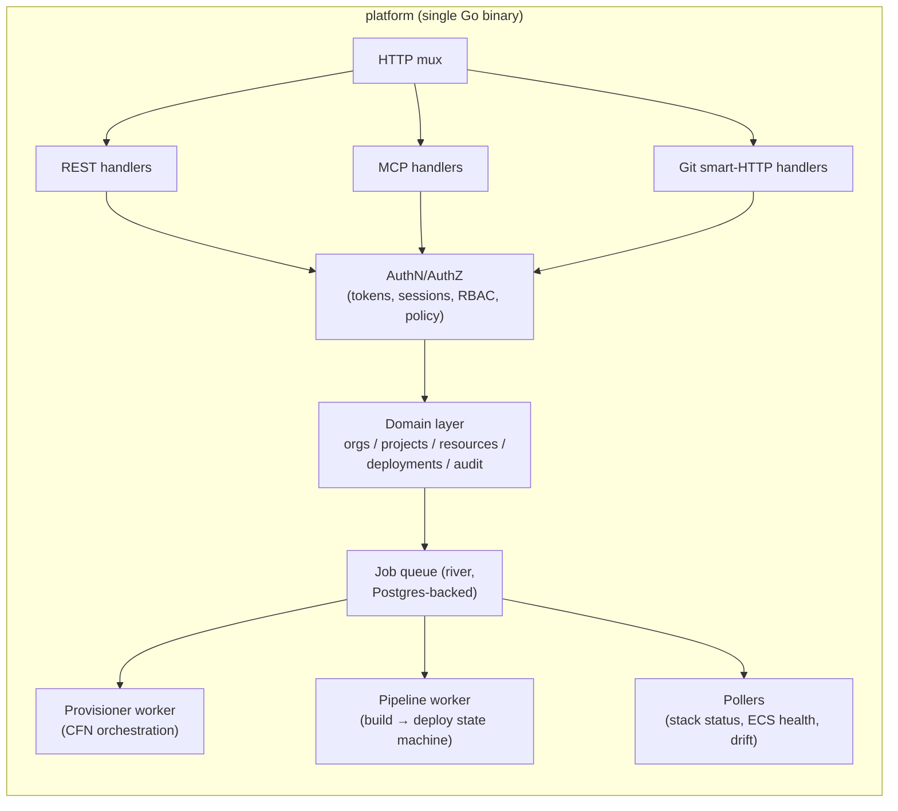
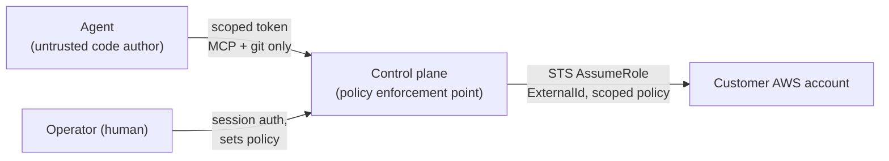

# 01 — Architecture

## Control plane vs data plane

The fundamental split: the **control plane** (our Go API, Postgres, git server, workers) holds metadata and orchestrates; the **data plane** (customer AWS accounts) holds all workload resources, built and mutated only through short-lived assumed-role credentials.

## Control plane: modular monolith

One Go binary, multiple internal modules, deployed as N identical replicas behind a load balancer. No microservices until scale forces it — the modules share a schema and a transaction boundary, which matters for audit consistency (a deploy row and its audit entry commit together).

Key choices:

- **Job queue in Postgres** ([riverqueue/river](https://github.com/riverqueue/river)): provisioning and deploys are multi-minute async jobs; keeping the queue in the same Postgres as the domain data gives transactional enqueue (job + audit row + state change commit atomically) and one fewer piece of infrastructure.
- **MCP and REST share the domain layer.** MCP tools are thin adapters over the same service methods the REST API uses — same authz, same audit, no drift between interfaces.
- **Git server is in-process** for the MVP: smart-HTTP (`git-upload-pack`/`git-receive-pack`) handlers over bare repos on a persistent volume, with async replication of repo contents to S3 for durability. A push's post-receive step enqueues a pipeline job in the same transaction that records the push. (See [04](04-git-and-cicd.md) for the build-vs-embed discussion.)
- **All AWS access is jittered, short-lived STS credentials** obtained per job via `AssumeRole` with a per-project `ExternalId`. The control plane never holds long-lived customer credentials in memory beyond a job's lifetime and never persists them (static-key fallback, if we allow it at all, is KMS envelope-encrypted at rest).

## Data plane: what lives in the customer account

Everything workload-related: VPC, Aurora, Fargate, ALB, S3, CloudFront, ECR, CodeBuild, CloudWatch logs, Secrets Manager secrets, KMS keys. The customer's AWS bill is their own; the platform bills for the control plane service. Detailed layout in [03-provisioning](03-provisioning.md).

## Trust boundaries

1. **Agent → control plane**: agents hold project-scoped tokens that can push code, trigger deploys, and read state. They can *request* resource changes; policy decides whether those apply immediately or wait for operator approval.
2. **Control plane → customer account**: the assumed role's policy is scoped to platform-tagged resources and the specific services in the catalog — not `AdministratorAccess`. CloudFormation is the only mutation path, which makes every infra change diffable and reviewable.
3. **Operator → control plane**: humans own policy, credentials, and guardrails. An agent can never widen its own permissions.

## Availability posture (MVP)

- Control plane: multi-AZ Postgres, ≥2 stateless API replicas; git repo volume is the one stateful component (single writer, S3-replicated, RPO ≈ minutes).
- An outage of the control plane must **not** take down customer workloads — data-plane resources run independently; only new deploys/changes are blocked. This is a hard requirement and a nice compliance/DR story.
