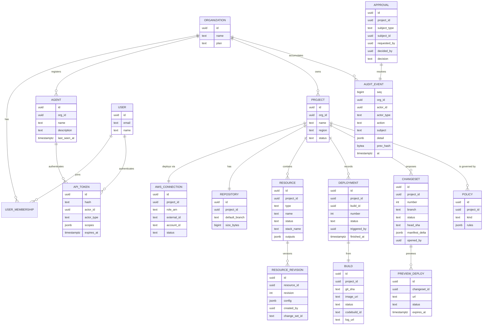

# 02 — Data model

## ERD

## Notes on the interesting tables

### `agent` — machine identity is first-class
Agents are not users. They belong to an org, have names and descriptions ("release-bot for project X"), and get their own tokens. Every audit event records `actor_type ∈ {user, agent, system}`. This is the core differentiator: when an auditor asks "who deployed this," the answer can be *"agent `claude-backend-dev`, token `tk_…`, from deployment request `dep_123`"* rather than a shared bot account.

### `api_token` — capability-scoped
Tokens carry explicit scopes (`repo:push`, `deploy:trigger`, `resource:propose`, `logs:read`, …) and a project binding. MCP sessions authenticate with these. Hash-only storage; revocation is a delete.

### `resource` + `resource_revision` — config as versioned document
A resource's user-facing config is small (the catalog is opinionated), e.g. Database: `{instance_class, storage_gb?, ha: bool}`. Every change creates a revision pointing at the CloudFormation change-set it produced, so infra history is: revision → change set → stack events. Nothing mutates in place.

### `deployment` — the compliance artifact
Immutable, monotonically numbered per project. Links git SHA → build → image digest → deploy outcome → who/what triggered it. This table *is* the change-management evidence for SOC 2.

### `audit_event` — append-only, hash-chained
`prev_hash` chains each event to the previous one per org (tamper-evidence). No UPDATE or DELETE grants on this table for the app role; written via a `SECURITY DEFINER` function or dedicated writer role. Exportable to the customer's S3 for retention.

### `policy` — operator guardrails
Rows like:
- `{kind: "approval", rules: {resource_changes: "require_human", deploys: "auto"}}`
- `{kind: "spend", rules: {monthly_ceiling_usd: 500}}`
- `{kind: "deploy_window", rules: {cron: "* 9-17 * * MON-FRI"}}` (optional)

Evaluated in the domain layer before any mutation; failures create an `approval` row instead of erroring, so agent workflows are "propose → wait" rather than "denied."

## Deliberate omissions (MVP)

- **Environments**: one project = one environment. "staging" = a second project (cheap because bootstrap is automated). Revisit if users demand promotion flows — see [07-roadmap](07-roadmap.md).
- **Teams/RBAC granularity**: org roles are just `owner | member | auditor` initially.
- **Multi-region**: `project.region` is singular.
