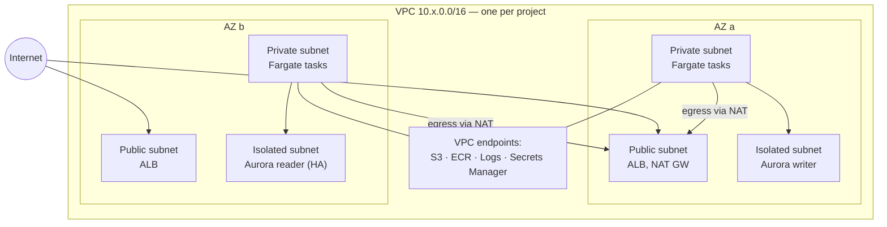
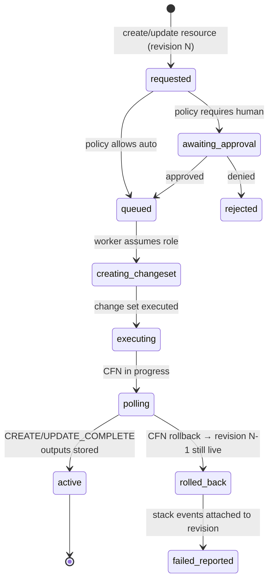

# 03 — Provisioning

## Connecting an AWS account

No static access keys. The operator connects a project to AWS by launching a **CloudFormation quick-create link** (or downloading the same template) in their account, which creates a single IAM role:

- Trusts the platform's AWS account principal
- Requires a per-project `sts:ExternalId` (generated by us, embedded in the template URL) — closes the confused-deputy hole
- Carries a scoped policy: CloudFormation, plus the catalog services (EC2/VPC, RDS, ECS, ECR, ELB, S3, CloudFront, CodeBuild, Secrets Manager, KMS, CloudWatch, IAM limited to `platform-*` roles with a permissions boundary)

The template's stack outputs (role ARN, account ID) are reported back via a tiny outbound webhook Lambda in the template, or the operator pastes the role ARN into the UI. The platform then runs a **verification job**: assume role → simulate the needed permissions → check service quotas (VPCs per region, EIPs) → mark connection `active`.

## Resource catalog

Each catalog entry is a versioned CloudFormation template maintained in the platform codebase, parameterized only by the small user-facing config. Users never see raw CloudFormation.

| Catalog type | AWS under the hood | Opinionated defaults (not configurable) | User config |
|---|---|---|---|
| **Network** (implicit, one per project) | VPC, 2 AZs, public + private + isolated subnets, 1 NAT GW, VPC endpoints (S3, ECR, Logs, Secrets Manager), flow logs | No IGW route from private/isolated; flow logs on; DNS on | none |
| **Database** | Aurora PostgreSQL Serverless v2 | Isolated subnets; SG ingress only from API SG; storage encrypted (project KMS CMK); TLS required; automated backups 14d; deletion protection; Secrets Manager–managed master creds with rotation | ACU min/max, HA (2nd AZ reader) |
| **API** | ECR repo + ECS Fargate service | Private subnets; no public IP; awslogs → CloudWatch (encrypted); read-only root FS; secrets injected from Secrets Manager; autoscaling on CPU; deployment circuit breaker + auto-rollback | CPU/mem size, min/max count, health check path, env vars (non-secret) & secret refs, port |
| **Load Balancer** | ALB | Public subnets; HTTPS only (HTTP→301); TLS 1.2+ policy; ACM cert w/ DNS validation; access logs → S3; idle timeout 60s | domain name |
| **Storage** | S3 bucket | Block Public Access; SSE-KMS (project CMK); versioning; TLS-only bucket policy; access logging; lifecycle noncurrent-expiry 90d | name suffix, optional CORS origins |
| **Web page** | S3 (private) + CloudFront + OAC | Origin Access Control (no public bucket); ACM cert (us-east-1); security headers policy (HSTS, CSP default, nosniff); TLS 1.2+; logging | domain name, SPA fallback on/off |

Cross-resource wiring (API SG → DB SG, ALB → API target group) happens via stack exports/SSM parameters that the templates read — users never wire security groups by hand, and *can't* wire them wrong.

## Project VPC layout

- Isolated subnets have **no route to NAT** — the database physically cannot reach the internet.
- VPC endpoints keep image pulls, log shipping, and secret reads off the public internet and cut NAT data-processing cost.
- One project = one VPC = hard blast-radius boundary between projects, even within the same customer account.

## Provisioning engine: CloudFormation, orchestrated by workers

**Decision: raw CloudFormation via SDK, not Terraform/Pulumi/CDK-at-runtime.**

- CFN *is* the state store — no Terraform state files to lock, encrypt, and migrate; the customer account holds its own record.
- Change sets give us a previewable diff for every resource revision → this is what an operator approves when policy requires it, and what lands in the audit log.
- Drift detection is a built-in API.
- Rollback on failed create/update is native.
- Cost: CFN is slower and clunkier than Terraform, and some day the catalog may need a resource CFN handles badly. Accepted for MVP; templates are versioned artifacts so a future engine swap is contained.

One stack per resource + one base network stack per project. Independent lifecycles, small blast radius per operation.

### Provisioning state machine

Workers are idempotent and resumable: every step records the CFN operation ID, so a crashed worker re-attaches to the in-flight stack operation instead of double-applying.

### Drift

A scheduled job runs CFN drift detection per stack (daily). Drift → resource flagged in UI + audit event + optional notification. Remediation is "re-apply revision" (one click / one MCP call). Out-of-band console changes are thus visible within a day — a real compliance selling point.

## Teardown

`delete resource` requires operator (human) confirmation always — agents can never delete. Database deletion takes a final snapshot first; buckets require explicit empty-confirmation. Project teardown deletes stacks in dependency order, network last.
