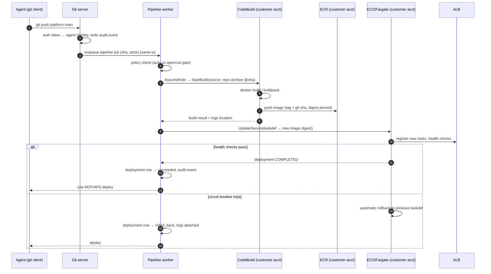

# 04 — Git server and CI/CD

## Why a built-in git server

The platform is the system of record for *deployable code*, not a collaboration hub. Agents need: a remote to push to, token auth, an event on push, and an immutable link from commit → build → deployment. That's a small fraction of GitHub/Gitea surface area, and owning it means the audit chain has no external dependency.

### Build vs embed

| Option | Pros | Cons |
|---|---|---|
| **Minimal smart-HTTP server (chosen)** — `git-receive-pack`/`git-upload-pack` over HTTPS against bare repos, via Go (`go-git` or shelling to `git http-backend`) | Tiny surface; auth/audit fully in our domain layer; push event is an in-process function call | We own repo storage durability |
| Embed Forgejo/Gitea | Full-featured day one | Second auth system, second database of record, webhook seam in the audit chain, huge unused surface |

MVP repo storage: bare repos on an EBS/EFS volume owned by a single git-writer instance; async `git bundle` replication to S3 after each push (RPO minutes). Reads can be served by any replica from the volume/replicas. Revisit with a stateless S3-backed object store for refs/packs if scale demands.

### Push rules (opinionated, fixed)

- `main` is the deploy branch and is **not directly pushable** — it moves only via `merge_changeset` (see [08](08-ux-helloworld.md)). Agents push feature branches and open **changesets**; a changeset can be preview-deployed, then merged (policy-gated, human click by default) which triggers the prod pipeline.
- Force-push to `main` is impossible by construction; force-push to changeset branches is allowed (agents iterate), but merged history is immutable evidence.
- Every push is authenticated by a project-scoped token bound to a user or agent identity; the push, ref, old/new SHA, and actor land in the audit log atomically with any pipeline enqueue.

## Pipeline

One fixed pipeline shape. No pipeline configuration files. The repo controls exactly two things: *how it builds* (a `Dockerfile`; buildpacks deferred — [07](07-roadmap.md) Q2) and *what exists* (the declarative `platform.yaml` resource manifest — see [08](08-ux-helloworld.md); it is a catalog-bounded manifest, not a pipeline, and cannot express build steps, IAM, or networking).

### Key decisions

- **Builds run in the customer's account via CodeBuild.** Customer code and images never execute on platform infrastructure — strong tenant isolation, compliance-friendly ("your code never leaves your account"), zero builder fleet to operate, and build compute lands on the customer's bill. Cost: ~30–60 s CodeBuild startup latency per build; acceptable for deploys (this is CD, not test-feedback CI).
- **Source delivery to CodeBuild**: worker uploads a tarball of the repo at the SHA to the project's platform-managed S3 artifacts bucket (customer account), CodeBuild pulls from there. The customer account never needs credentials back into the git server.
- **Images pinned by digest** in the task definition — a tag can't be silently repointed.
- **Deploy = ECS rolling update with deployment circuit breaker**; failed health checks auto-roll back. `rollback` as an explicit operation just redeploys a previous deployment's digest.
- **Migrations**: MVP supports an optional `release` command (Procfile-style, à la Aptible/Heroku `before_release`) run as a one-off Fargate task between build and service update; failure aborts the deploy.
- **Logs**: build logs from CodeBuild/CloudWatch, runtime logs from CloudWatch — streamed through the API/MCP with the platform's assumed-role creds, so agents never need AWS access to debug.

### What agents get that GitHub Actions doesn't give them

- No YAML to mutate: the pipeline is not attackable via the repo contents (a compromised/hallucinating agent can't edit a workflow file to exfiltrate creds — there are no creds in the build env beyond ECR push).
- Deterministic, small action space: push, watch, read logs, rollback.
- Structured deploy state over MCP instead of scraping check-run logs.
