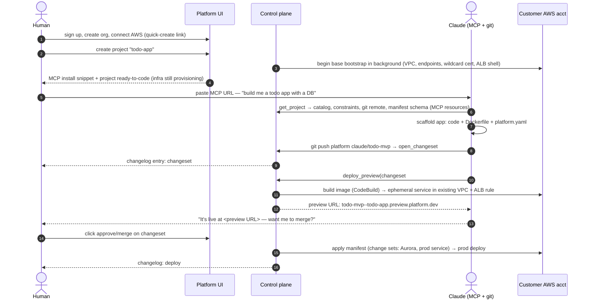

# 08 — UX: time to hello world

The product lives or dies on this loop. Target: **describe → preview URL in under 15 minutes**, with the only human-hands steps being account signup, AWS connect, and pasting an MCP URL into Claude.

## The golden path



## What this flow changes in the earlier design (accepted)

### 1. `platform.yaml` — a resource **manifest** in the repo (revises [03](03-provisioning.md)/[04](04-git-and-cicd.md))

Resources are now declared in-repo rather than created via API calls. This is the right call for agents: one changeset atomically proposes *code + the infra it needs*, and the reviewable unit is a single diff.

```yaml
# platform.yaml — declarative, catalog-only, bounded schema
services:
  api:
    type: api                 # → Fargate
    size: small
    port: 8080
    health_check: /healthz
    env:
      DATABASE_URL: ${database.main.url}   # platform-wired, never a pasted secret
    release: ./bin/migrate    # optional one-off task before traffic shift
  web:
    type: web                 # → CloudFront + S3
    spa: true
resources:
  database:
    main:
      type: database          # → Aurora Serverless v2
      ha: false
routes:
  - domain: default           # platform subdomain; custom domains via UI later
    service: api
```

**Line held from the original design:** this is a *manifest*, not a pipeline. It declares **what** exists from the closed catalog (validated against a strict schema at push time — unknown keys and out-of-range values are push-rejected). It cannot express build steps, shell (except the sandboxed `release` task, which runs in the customer account with no platform credentials), IAM, security groups, or public buckets. The security property "repo contents cannot attack the pipeline or widen permissions" survives intact.

Source of truth: the manifest at the merged SHA. API/MCP resource mutation endpoints become read + propose-only conveniences that generate manifest PRs, not a parallel write path — two write paths would guarantee drift.

### 2. Changesets replace bare approval gates (revises [02](02-data-model.md)/[04](04-git-and-cicd.md))

A **changeset** = branch + optional manifest delta + conversation-visible metadata (agent's description of what/why). It's the PR, the approval unit, and the changelog entry all at once:

- Pushing a non-main branch + `open_changeset` (MCP) creates it; pushing more commits updates it.
- The changelog view renders: code diff stat, **manifest plan** (rendered CFN change-set preview: "creates Aurora cluster ~$43/mo"), cost delta, agent attribution, preview status.
- Merge is a platform operation (`merge_changeset`, fast-forward or squash — no manual merges), gated by policy: default **human click required**; orgs can allow auto-merge for code-only changesets and require humans only when the manifest changes.
- Merge → manifest applied (CFN change sets executed) → prod build/deploy. One button from reviewed to live.

New tables: `changeset` (project, branch, status, base/head sha, manifest_delta, opened_by) and `preview_deploy`.

### 3. Branch/preview deploys — shared-infra by design (new)

A naive preview = full stack per branch = **~15–25 min and real money** (Aurora + ALB + CloudFront per branch). That's the hidden UX killer, so previews are opinionated-cheap:

| Component | Production | Preview |
|---|---|---|
| VPC / subnets | project VPC | **same VPC** |
| Compute | prod Fargate service | ephemeral Fargate service (size=small, count=1) |
| Routing | prod ALB + optional CloudFront | **rule on the existing ALB**, host `branch--project.preview.platform.dev` (pre-issued wildcard cert) |
| Database | project Aurora | **fresh empty DB on the shared preview Aurora instance** (or schema), `release` migrations run; opt-in: Aurora fast-clone of prod (copy-on-write) — off by default because prod data in previews is a compliance foot-gun |
| Manifest changes | applied on merge | **never applied** — shown as a plan only |
| Lifecycle | until superseded | TTL: auto-teardown after 72 h idle or on changeset close |

Result: preview wall-clock ≈ image build + task start ≈ **3–5 min**, marginal cost ≈ one small Fargate task.

### 4. Background bootstrap at project create (revises [03](03-provisioning.md))

The base stack (VPC, endpoints, ALB, wildcard preview cert, preview Aurora) starts provisioning **the moment the project is created** — while the human is pasting the MCP URL and Claude is writing code. By the time the first changeset wants a preview (~10+ min later), the slow infra exists. MCP `get_project` exposes provisioning progress so the agent can narrate ("infra is 80% ready, finishing the ALB…") instead of failing.

### 5. Zero-DNS default (revises [03](03-provisioning.md)/[05](05-interfaces.md))

Hello-world must not require touching a DNS console. Every project gets `{project}.app.platform.dev` (prod) and `*.preview.platform.dev` (previews) on platform-managed DNS + pre-issued ACM certs. Custom domains (ACM DNS validation in customer DNS) are a later, UI-guided step — never on the critical path.

### 6. Org-level AWS connection (revises [02](02-data-model.md)/[03](03-provisioning.md))

Connect AWS **once per org**, not per project — otherwise the second project re-runs the worst step of onboarding. Projects get per-project `ExternalId`-scoped role *sessions* and their own VPC inside the shared connected account. (Account-per-project stays available later for large orgs.)

## Remaining friction — honest accounting

1. **AWS connect is still the worst step** (have an AWS account, click quick-create, wait ~2 min). Unavoidable in the BYO-account model. Future option: a platform-hosted sandbox account so hello-world needs *no* AWS at all, with "connect AWS" required only to promote to production — big feature, big onboarding win; parked in [07](07-roadmap.md) Phase 3.
2. **First prod merge is slow** (~10–15 min: Aurora create + first CloudFront distribution). Mitigated by background bootstrap of the shared preview DB (instant previews), but the *first production* database is honest wall-clock. The agent narrates progress; the UI shows the CFN events live.
3. **`web` build step**: static assets need `npm run build` somewhere. MVP: multi-stage Dockerfile convention where the image exports `/public` → synced to S3. Keeps "no build config" true; revisit if it chafes.
