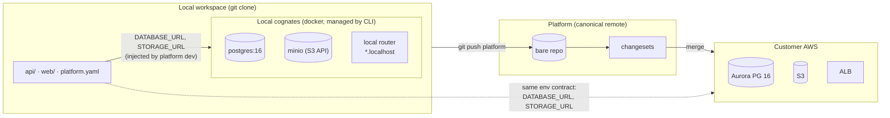

# 09 — Git structure & local development

## The model

The platform is the **canonical remote**; every project also lives as a **local workspace** — a normal git clone where a human and their Claude develop with full shell access. The bridge between the two planes is the manifest:

> `platform.yaml` declares *what the project needs*. The platform materializes it as AWS resources; the local workspace materializes it as **local cognates**. Application code sees the identical env-var contract in both, so it never knows which plane it's running on.



## Git structure

**One repo per project**, created with the project; the platform is `origin` (or remote name `platform`). Services are subdirectories; the manifest is at the root:

```
hello-world/
├── platform.yaml          # the manifest — single source of truth for both planes
├── api/
│   ├── Dockerfile
│   └── ...code
├── web/
│   └── ...code
├── seeds/                 # optional: local/preview seed data scripts
└── .platform/             # gitignored: compose file, injected env, local state
```

- **Branch model** (unchanged from [08](08-ux-helloworld.md)): `main` is deployed truth and only moves via `merge_changeset`. Agents work on branches (`claude/<slug>`) in the local clone, push, and open changesets. `open_changeset` stops carrying file contents once this lands — it references a pushed branch; the JSONB-files version in the current slice is the placeholder for exactly this.
- **Remote URL**: `https://<platform>/git/<project>.git`, token auth (same scoped tokens as MCP). MCP's `get_git_credentials` hands the agent a short-lived push credential.
- **Multiple agents, one project**: branches are the isolation unit — same as human teams. Two agents on two features = two branches = two changesets, merged serially through the changelog.

## The cognate table

Each catalog type defines its own local cognate — chosen by the platform, not the user, and version-pinned to match what the platform provisions remotely:

| Catalog type | Remote (AWS) | Local cognate | Parity notes |
|---|---|---|---|
| `database` | Aurora PostgreSQL 16 | `postgres:16` container | Near-perfect: same wire protocol, same SQL. Aurora-specific behaviors (failover, ACU scaling) are ops concerns, invisible to app code |
| `storage` | S3 | MinIO container | S3-compatible API; SDKs work with endpoint override. IAM subtleties don't exist locally — acceptable, code uses one injected credential either way |
| `api` | Fargate service | `docker build` + run of the service's Dockerfile (or a native `dev` command for hot reload) | The Dockerfile *is* the parity contract |
| `load-balancer` / routes | ALB | tiny local router: `api.hello-world.localhost:443x` → service ports | Just route mapping; TLS/WAF are ops concerns |
| `web` | CloudFront + S3 | static file server (or the framework's dev server) with SPA fallback | CDN behavior is an ops concern |
| `cache` (future) | ElastiCache Redis | `redis:7` container | Near-perfect |

Two rules keep this honest:

1. **The env contract is the interface.** In prod, the platform injects `DATABASE_URL`, `STORAGE_URL`/`STORAGE_BUCKET`, etc. from provisioned resources. Locally, `platform dev` injects the same names pointing at cognates. Application code contains zero environment detection.
2. **The catalog stays boring on purpose.** Postgres, S3-API, HTTP, Redis — services with faithful local cognates. A managed service with no local cognate (Kinesis, DynamoDB streams, SQS-triggered lambdas…) breaks the local story and should fight hard to get into the catalog. Parity is now a *catalog admission criterion*.

## The `platform` CLI

A small CLI (same Go codebase, thin client over API + docker) orchestrates the local plane. Claude uses it through its shell — no new MCP surface needed for local work:

```
platform new hello-world     # create remote project (API), clone it, scaffold platform.yaml
platform clone hello-world   # existing project → local workspace
platform add database main   # edit manifest + start cognate + inject env (one step)
platform dev                 # read manifest → up cognates (compose) → run services with injected env
platform env                 # print the injected contract (for debugging)
platform push                # push branch + open changeset (wraps git push + MCP)
platform status              # remote state: changesets, deploys, drift
```

`platform add` is the answer to "if a design calls for a DB": it edits `platform.yaml` *and* starts the local cognate in one motion, so the manifest and the local environment cannot disagree. The manifest diff then rides in the changeset, and merge materializes the real Aurora. One decision, declared once, realized twice.

Cognates run via a generated docker-compose file in `.platform/` — per-project isolation (two projects = two postgres containers on different ports), pinned versions, disposable state. `platform dev --reset` wipes local data. Docker is a hard dependency of local dev; that's an acceptable, conventional ask.

## Data rules

- Local databases start **empty + migrations + `seeds/`**. Prod data never syncs down by default — a compliance foot-gun ([08](08-ux-helloworld.md) made the same call for previews). An explicit, operator-approved, audited export path can exist later.
- `.platform/` (local state, env, credentials) is gitignored by scaffold; the push path can also hard-reject files matching secret patterns as a belt-and-suspenders control.

## Flow: "add a feature that needs a database"

1. Human to local Claude: *"add persistent todos."*
2. Claude (shell): `platform add database main` → manifest gains the resource, `postgres:16` cognate starts, `DATABASE_URL` now injected locally.
3. Claude writes the migration + code, runs `platform dev`, tests against the cognate.
4. `git push platform claude/todos` + `open_changeset` → changelog shows code diff **and** manifest plan ("creates Aurora Serverless v2, ~$43/mo").
5. Human approves → merge → platform applies the manifest (real Aurora) → deploys → same code, same env names, real database.
