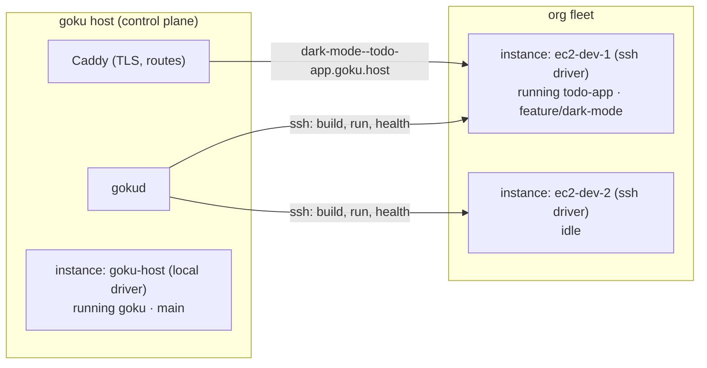

# 10 — Fleet: SSH-attached deploy targets

## The idea

A **fleet** is an organization's set of deploy targets. Each **instance** is a
host goku can run containers on — the goku host itself is the first one, an
EC2 box you enroll is the next. The MVP model is deliberately simple:

> **An instance is a slot: it runs at most one branch of one project at a
> time.** The Fleet tab shows every instance and what it's building/running.

Capacity-1 makes placement trivial, matches the "spin up a box to try a
branch" mental model, and leaves room to raise capacity later (ports and
isolation already support it) without changing the model's shape.



## Data model

```
instances (
  id, org_id, name,
  driver        'local' | 'ssh',
  address       user@host:port          -- ssh driver
  ssh_key       text                    -- write-only, like secrets
  host_key      text                    -- pinned on first connect (TOFU)
  status        verifying | ready | unreachable | failed
  facts         jsonb                   -- arch, docker version, cores, mem, disk
  check_log     text
  last_checked_at
)
deployments += instance_id              -- where it ran
```

Instances are uniform — there is no "head" or special node. Where gokud
itself runs is an operational detail invisible to normal users (it's just
the SaaS API). It happens that the operator dogfoods goku, so their fleet
member `ubuntu` shows an ordinary assignment: `goku · main`. Nothing in the
model distinguishes it.

## Enrolling an instance

UI: **Fleet** tab (sidebar, under Projects) → *Add instance*: name,
`user@host[:port]`, paste the private key (.pem). The key is write-only —
stored like secrets, never returned by any API.

Then a **verification pipeline** runs (logged like a deployment):

1. TCP + SSH handshake + auth; pin the host key (trust-on-first-use — flag if
   it ever changes)
2. `uname -m` + OS release → facts (arch matters: builds happen **on** the
   instance, so arm64 instances build arm64 images — no cross-build problem)
3. `docker info` — daemon present and the SSH user can use it; on failure the
   check log says exactly what to run (`curl -fsSL https://get.docker.com |
   sh && usermod -aG docker <user>`)
4. Disk / memory facts; outbound network (image pull test)
5. → `ready`, re-checked periodically; failures flip status to `unreachable`
   with the error in the check log

For EC2 specifically, phase two closes the loop: with an AWS connection, goku
*launches* the instance (AMI with docker, security group allowing only the
control plane) and enrolls it automatically — the fleet becomes the bridge
between "my boxes" and the full AWS materialization (Fargate) in the design
docs.

## Deploying to the fleet

- `goku deploy <branch> --on <instance>` / instance picker in the UI deploy
  button / MCP `deploy_project` gains an optional `instance`.
- No instance named → placement is **sticky per assignment**: a redeploy of
  `project · branch` goes to the instance already running it; a fresh
  assignment takes any `ready` + idle instance, else error "fleet is full —
  add an instance or free one".
- The engine's steps become driver operations. The trick that keeps the ssh
  driver small: **docker build accepts a tar context on stdin**, so build is
  `git archive <sha> | ssh <instance> docker build -t  -` — no registry,
  no image shipping, the repo never lands on disk remotely.
- Databases for ssh instances run as a postgres **container on the instance**
  (data lives and dies with the assignment — right for branch environments;
  durable prod data stays on the goku host / future Aurora).
- Health check runs over ssh; on success the control plane's Caddy routes
  - `main` on home instance → `<project>.goku.host` (as today)
  - branch on instance → `<branch-slug>--<project>.goku.host` → `instance:port`
- Freeing: replacing an instance's assignment stops the old container;
  an explicit *Release* action stops it and returns the slot to idle.

## Honest constraints (MVP)

- Control plane → instance app traffic is plain HTTP behind the TLS
  terminator; acceptable on a LAN or a security-grouped VPC where only the
  control plane can reach the instance port. Public-internet instances should
  firewall app ports to the control plane's IP (the verifier can check this);
  a wireguard/tailscale mesh is the clean later answer.
- Branch subdomains use `--` as the separator (`feature-dark-mode--todo-app`)
  because `/` can't live in a hostname and extra dots would break the
  wildcard cert.
- One branch per instance is policy, not physics — capacity-N is a schema
  field away when it's wanted.
